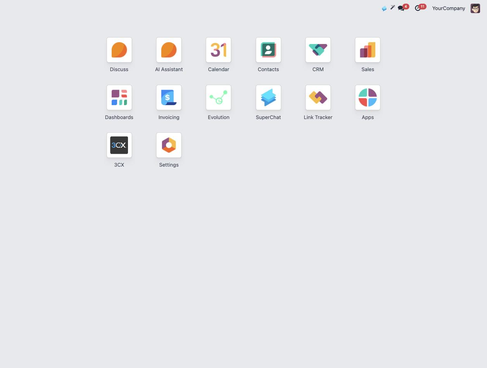
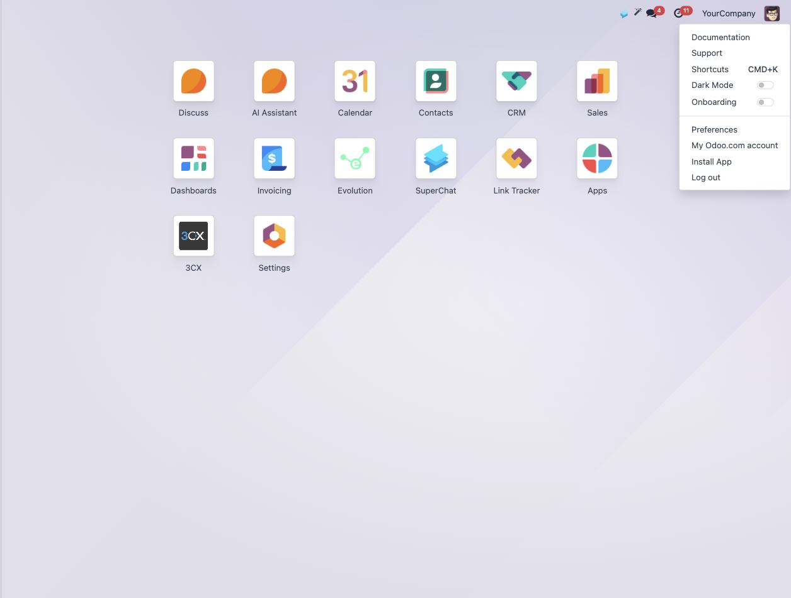
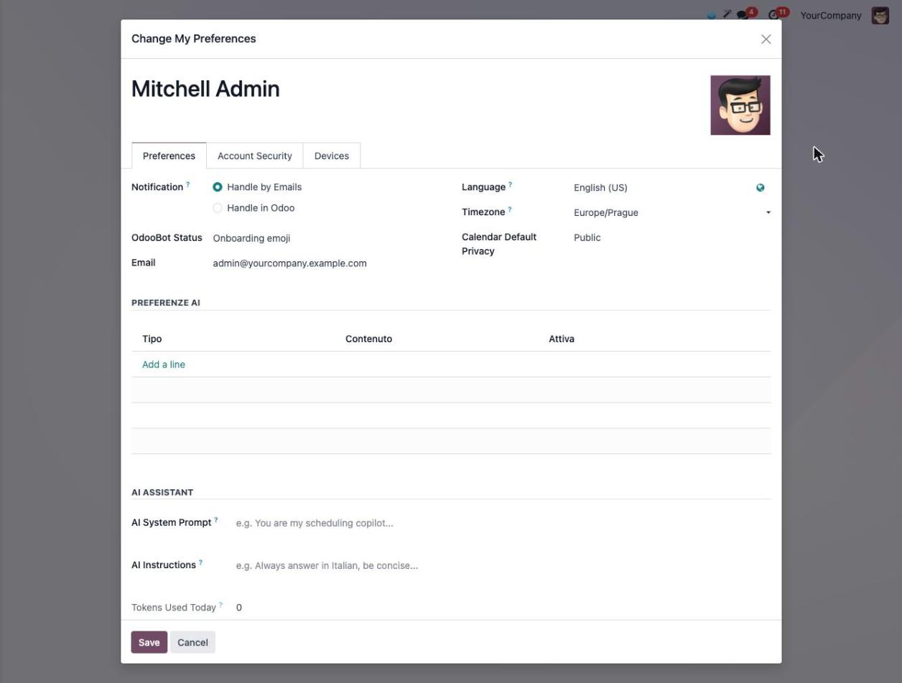
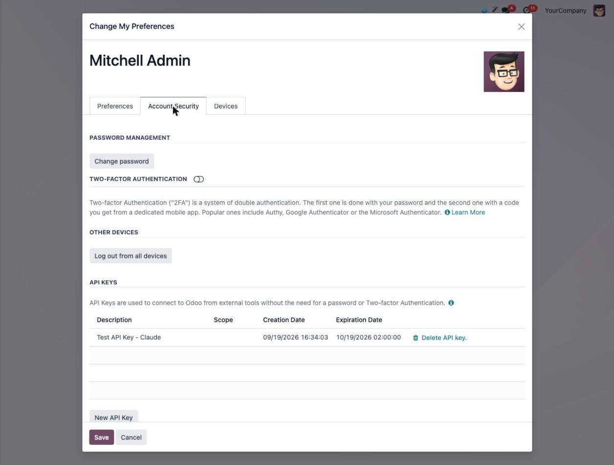
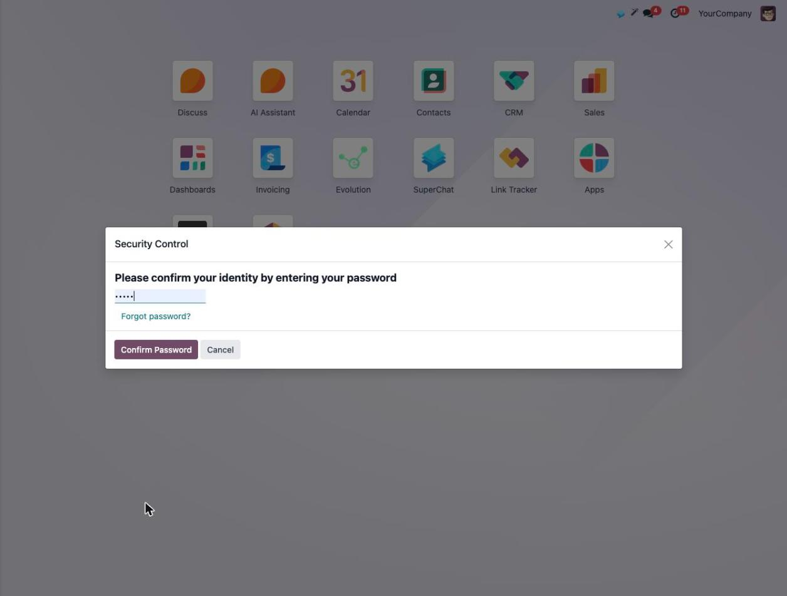
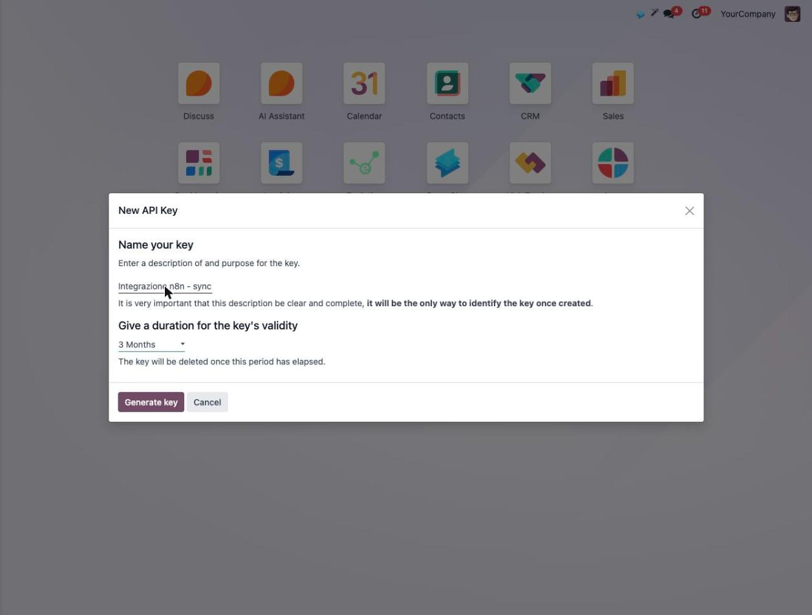
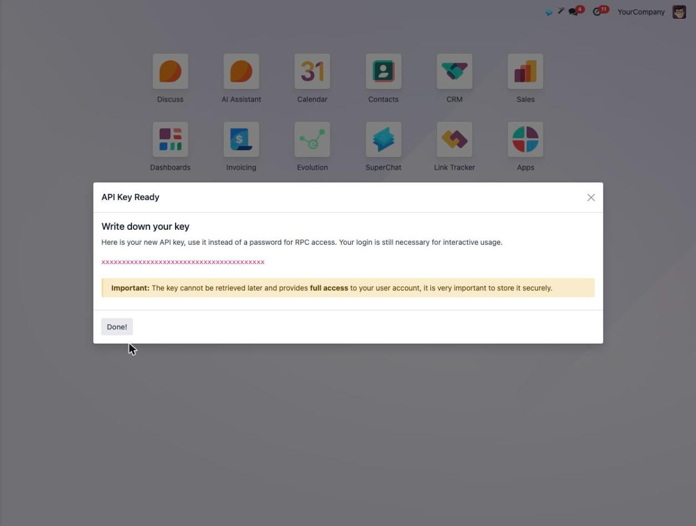

# How to create an Odoo API key

This server authenticates with an **API key**, never an account password. A key
belongs to one Odoo user and carries exactly that user's permissions, you can
create several, and you can revoke any of them on its own at any time without
touching your password.

The screens below are **Odoo 18**. Odoo 14 through 19 differ only in wording,
and the path is the same on Odoo Online, Odoo.sh and self-hosted.

---

## 1. Open the user menu

In Odoo, click your **avatar** at the top right — your profile picture, or your
initials.

## 2. Choose Preferences

In the menu that drops down, choose **Preferences**. Some versions call it *My
Profile*.

## 3. The preferences window opens

It opens on the **Preferences** tab. The one you want is next to it.

## 4. Go to Account Security

Switch to the **Account Security** tab and scroll to **API Keys**. Keys you
already have are listed by description and date — never by value — and the
button you want is **New API Key**.

## 5. Confirm it is you

Odoo asks for your own password before it will make a key. This confirms your
identity to Odoo; it is not shared with anyone, and this server never asks you
for it.

## 6. Name the key and set how long it lasts

The **name** is the only way you will recognise this key later, so say what it
is for — *Odoo Assistant* does the job. Then pick a **duration**: when it
elapses the key is deleted and the connection stops working, so choose a period
you are willing to renew. Press **Generate key**.

## 7. Copy it now — it is shown once

The key appears in full exactly once. Copy it into your host configuration as
`ODOO_API_KEY`, or into your password manager. Once you close this window Odoo
cannot show it again: a key you lose is a key you replace.

---

## Notes

* **Odoo 19** requires both a description and an expiry date, three months at
  most — so a connection there needs a new key every quarter.
* **Before Odoo 17** there was no duration field at all: keys never expired.
* The key bypasses two-factor authentication in RPC calls, which is why it must
  be treated as a credential of the same weight as the password.
* For an integration it is good practice to create a **dedicated technical
  user** with the minimum groups it needs, and generate the key from there.
* To revoke: *Preferences → Account Security → API Keys → Delete API key*.
  Revoking inside Odoo ends this server's access immediately.

The same walkthrough is shown on the consent page of the hosted server, next to
the field that asks for the key.
